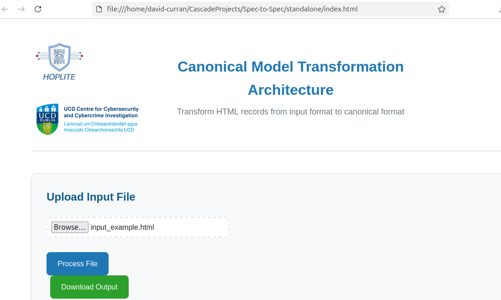
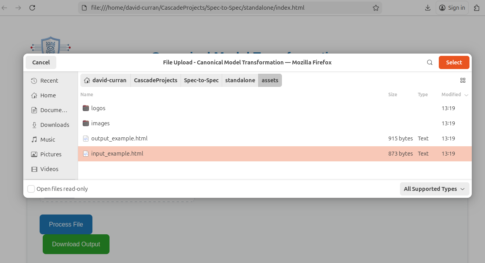

# Report Converter

## Intro

This application transforms HTML records from an input format to a canonical (standardised) format. Users can select HTML files containing a record, and the application will automatically parse, transform, and generate output HTML files in the canonical format.



The application automatically processes files when selected and provides visual warnings for missing or invalid fields.



## File Structure

```
transcribe/
├── assets/
│   ├── input_example.html    # Example input file format
│   └── output_example.html   # Example output file format
├── dist/                     # Compiled JavaScript (generated)
├── src/                      # TypeScript source files
│   ├── types.ts              # Type definitions
│   ├── parser.ts             # HTML parsing logic
│   ├── transformer.ts        # Data transformation logic
│   ├── generator.ts          # Output HTML generation
│   └── main.ts               # Main application and UI
├── index.html                # Main web page
├── package.json              # Dependencies and scripts
├── tsconfig.json             # TypeScript configuration
└── README.md                 # This file
```

## Building and Running

### Development (with server)

1. Install dependencies:
   ```bash
   npm install
   ```

2. Build the project:
   ```bash
   npm run build
   ```

3. Start a local server:
   ```bash
   npm run serve
   # or
   python3 -m http.server 8000
   ```

4. Open `http://localhost:8000` in your browser

### Standalone Version (No Server Required)

To create a standalone version that works without a server (just double-click the HTML file):

```bash
npm run build:standalone
```

This creates a `standalone/` directory containing:
- `index.html` - **Single file** with all JavaScript, CSS, images, and favicon inlined as base64 (works offline)

**To distribute:** Simply share the `standalone/index.html` file. Users can:
- Double-click `index.html` to open it in their browser
- Or open it directly from the file system (no server needed!)
- **No additional files or folders required** - everything is in one HTML file!

## Todo

- [x] Improve UI styling
- [ ] Add support for additional input formats
- [ ] Add validation for input data
- [ ] Add error handling improvements
- [ ] Add unit tests
- [ ] Improve file icon for end users' systems (Windows/Linux file manager icons) 
